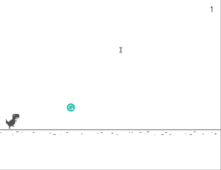

# DinoGameCpp

A clone of the classic T-Rex running game in C++ using SDL library.

## Dependencies for Running Locally
* cmake
* make
* SDL2
* SDL2_ttf (on debian => sudo apt-get install libsdl2-ttf-dev)
* gcc/g++

## Basic Build Instructions

1. Clone this repo.
2. Make a build directory in the top level directory: `mkdir build && cd build`
3. Compile: `cmake .. && make`
4. Run it: `./DinoGame`.